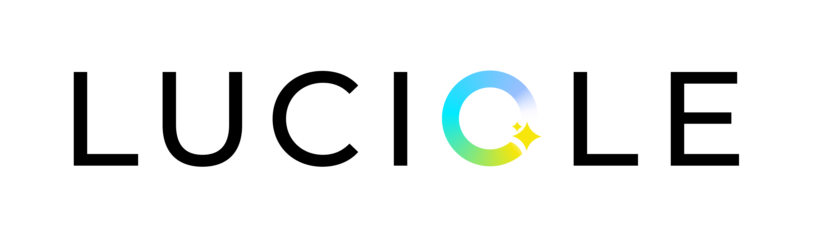

# Model Card for Luciole-1B-Audio-1.0

* [Model Description](#model-description)
  * [Bias, Risks, and Limitations](#bias-risks-and-limitations)
  * [Recommendations](#recommendations)
* [Training Details](#training-details)
  * [Training Data](#training-data)
  * [Instruction template](#instruction-template)
  * [Training Procedure](#training-procedure)
* [Evaluation](#evaluation)
* [Testing the model](#testing-the-model)
* [Citation](#citation)
* [Acknowledgements](#acknowledgements)
* [Contact](#contact)

## Model Description

**Luciole-1B-Audio-1.0** is a version capable of understanding audio of [Luciole-1B-Instruct-1.1](https://huggingface.co/OpenLLM-France/Luciole-1B-Instruct-1.1).
The model was developed by [LINAGORA](https://linagora.com) and
[OpenLLM-France](https://huggingface.co/OpenLLM-France) consortium, as part of the OpenLLM France project funded by
[BPI France](https://www.bpifrance.fr/) under the France 2030 program.

The training of Luciole-1B-Audio-1.0 was conducted on Jean Zay supercomputer managed by [IDRIS](http://www.idris.fr/docs/idris/missions),
using the [NVIDIA NeMo Speech](https://github.com/NVIDIA-NeMo/Speech).
The model was trained on various tasks and types of audios including ASR (Automatic Speech Recognition), AST (Automatic Speech Translation), QA (Question Answering), Sound (Question Answering and Captioning), Music (Question Answering and Captioning) and more.

### Bias, Risks, and Limitations

- Inherits the limitations of the base [Luciole-1B-Instruct-1.1](https://huggingface.co/OpenLLM-France/Luciole-1B-Instruct-1.1)
  language model: it can struggle with math word problems, is susceptible to hallucination, and its
  context window is limited to 16,384 tokens.
<!-- - The audio encoder and its front-end were entirely frozen during training, so audio understanding is bounded by what
  Parakeet-TDT-0.6B-v3 already hears — the model cannot learn to compensate for acoustic conditions the
  encoder itself handles poorly. -->
- Training data was concentrated on French and English (ASR, AST, spoken QA). Expect the strongest performance on fr/en tasks and treat other
  languages, and the music/sound captioning tasks, as less tested.
<!-- - LoRA fine-tuning only touches attention projections in the LLM; no additional audio-specific safety or
  refusal tuning was performed beyond what the base LLM already has. -->

### Recommendations

- Use for French/English speech transcription, translation, spoken question answering, and audio/music/
  sound description in a conversational setting. Verify quality yourself before relying on it for other
  languages or for dedicated ASR/AST pipelines, where a specialized model may still do better.
- As with the base LLM, pairing it with a RAG pipeline helps when up-to-date or domain knowledge is
  needed.

## Training details

### Training data

Trained on the [OpenLLM-France/Luciole-Audio-Training-Dataset](https://huggingface.co/datasets/OpenLLM-France/Luciole-Audio-Training-Dataset),
a large multilingual, multi-task collection of audio–text conversations comprising : ASR (Automatic Speech Recognition),
AST (Automatic Speech Translation), spoken question answering, summarization, diarization, temporal localization,
speaker/gender/age/emotion/language recognition, and music/sound captioning and QA (Question Answering).

### Instruction template

Same chat template as the base LLM (inspired by Qwen3), extended with an `<|audio|>` locator tag:
wherever `<|audio|>` appears in a turn, the corresponding audio segment is encoded and its embeddings
replace the tag before the sequence reaches the LLM. Conversations can carry several audio clips and mix
audio-only, text-only, and audio+text turns within the same dialogue — see the
[dataset card](https://huggingface.co/datasets/OpenLLM-France/Luciole-Audio-Training-Dataset) for example
conversations.

### Training Procedure

| | |
|---|---|
| Audio encoder | Parakeet-TDT-0.6B-v3 Conformer encoder, frozen |
| RoTE | Applied between audio encoder and audio adapter. θ=1200, rotary fraction=0.2. Inspired by [Goel et al., 2024, OMCAT](https://arxiv.org/abs/2410.12109).|
| Audio adapter | Linear(1024→2048) projection into the LLM embedding space |
| LLM | Luciole-1B-Instruct-1.1, adapted with LoRA (on `q_proj`/`v_proj`, r=64, α=64) |
| Trainable params | 12.3M / ~1.9B (0.6%) |
| Optimizer | AdamW (β=(0.9, 0.98), weight decay 0.001) |
| LR schedule | Cosine annealing (max LR 2e-4, min LR 1e-6, 500 warmup steps) |
| Batching | Dynamic, bucketed by audio duration (27 buckets) |
| Steps | 100,000 |
| Gradient clipping | 1.0 |
| Strategy | DDP, 1 node × 4 GPUs |
| Precision | bf16 |

The model was trained for 100k steps and drew from a weighted, randomly-ordered, sharded mix of that dataset,
bucketed by duration into 27 buckets (up to 1,200s / 16,384 audio-equivalent tokens per example) with a
matching dynamic batch size per bucket (238 down to 1).

Validation covered CommonVoice ASR (fr/en/ar),
Multilingual TEDx speech translation (fr→en), spoken QA (SLUE-SQA-5, VoxPopuli-QA, en/fr), and audio/music
captioning (AudioCaps, MusicCaps).

## Evaluation

✍ Coming soon!

## Using the model

### With vLLM

The exported checkpoint's `config.json` declares `"model_type": "nemo_speechlm"` and
`"architectures": ["NeMoSpeechLMForConditionalGeneration"]`. Both are registered with vLLM by the SALM
plugin that ships inside `nemo-toolkit`
([`nemo.collections.speechlm2.vllm.salm`](https://github.com/NVIDIA-NeMo/Speech/tree/main/nemo/collections/speechlm2/vllm/salm))
via the `vllm.general_plugins` entry point:

```toml
[project.entry-points."vllm.general_plugins"]
nemo_speechlm = "nemo.collections.speechlm2.vllm.salm:register"
```

vLLM auto-discovers this plugin at startup as soon as `nemo-toolkit` and `vllm` are installed in the same
environment. The plugin merges the
LoRA adapters into the LLM backbone on load and runs the frozen Parakeet encoder + connector to turn each
`<|audio|>` tag into the right number of audio-embedding slots before generation.

**Install using uv**

```bash
uv venv .venv --python 3.12
source .venv/bin/activate

uv pip install "nemo-toolkit[speechlm2,tts] @ git+https://github.com/linagora-labs/NeMo.git@luciole_speech.3.1.0-rc0"
uv pip install vllm==0.28.0
uv pip install "numpy<=2.4"
```

**Serve**

```bash
vllm serve OpenLLM-France/Luciole-1B-Audio-1.0 \
    --max-model-len 16384
```

**Query** (OpenAI-compatible chat API — audio sent as base64):

```python
import base64
from openai import OpenAI

client = OpenAI(base_url="http://localhost:8000/v1", api_key="EMPTY")

with open("sample.wav", "rb") as f:   # 16 kHz mono
    audio_b64 = base64.b64encode(f.read()).decode()

response = client.chat.completions.create(
    model="Luciole-1B-Audio",
    messages=[
        {
            "role": "user",
            "content": [
                {"type": "text", "text": "Transcris cet audio en français : <|audio|>"},
                {"type": "input_audio", "input_audio": {"data": audio_b64, "format": "wav"}},
            ],
        }
    ],
)
print(response.choices[0].message.content)
```

The `<|audio|>` placeholder is the same `audio_locator_tag` used during training — put it in the text
wherever the audio should be attended to; the plugin expands it automatically. Audio must be 16 kHz mono;
the encoder supports chunked processing for long-form audio (well beyond the durations seen in training).

### With NeMo

The checkpoint can also be loaded directly with NeMo's `SALM` class
([`nemo.collections.speechlm2.models.salm`](https://github.com/NVIDIA-NeMo/Speech/blob/main/nemo/collections/speechlm2/models/salm.py)).

**Install**

```bash
uv venv .venv --python 3.12
source .venv/bin/activate

uv pip install "nemo-toolkit[speechlm2,tts] @ git+https://github.com/linagora-labs/NeMo.git@luciole_speech.3.1.0-rc0"
```

**Load and generate:**

```python
import torch
from nemo.collections.speechlm2 import SALM

model = SALM.from_pretrained("OpenLLM-France/Luciole-1B-Audio-1.0")  # or a local checkpoint directory
model = model.eval().to(torch.bfloat16).to("cuda")

# High-level API: pass the audio file path(s) directly in the prompt, next to the
# `<|audio|>` placeholder — SALM loads and resamples the audio for you.
answer_ids = model.generate(
    prompts=[
        [
            {
                "role": "user",
                "content": f"Transcris cet audio en français : {model.audio_locator_tag}",
                "audio": ["sample.wav"],
            }
        ]
    ],
    max_new_tokens=256,
)
print(model.tokenizer.ids_to_text(answer_ids[0].tolist()))
```

A prompt can carry several turns and several audio clips (one `<|audio|>` tag per clip, in order).

## Citation

✍ Coming soon!

## Acknowledgements

Training of Luciole-1B-Audio-1.0 was made possible by computing AI and storage resources by GENCI at IDRIS thanks to the grant 2025-AS011016445 on the supercomputer Jean Zay’s H100 partition. We gratefully acknowledge support from GENCI and IDRIS and from Stephane Requena (GENCI) and Pierre-François Lavallée (IDRIS) in particular.

<!-- TODO: contributor list, à la Luciole-1B-Instruct-1.1's Acknowledgements section -->

## Contact

contact@openllm-france.fr
